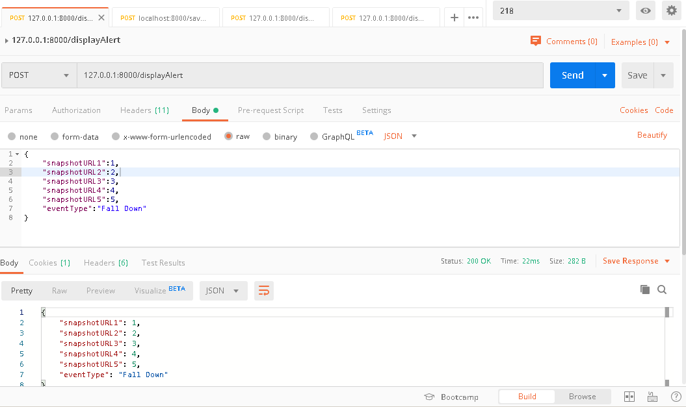
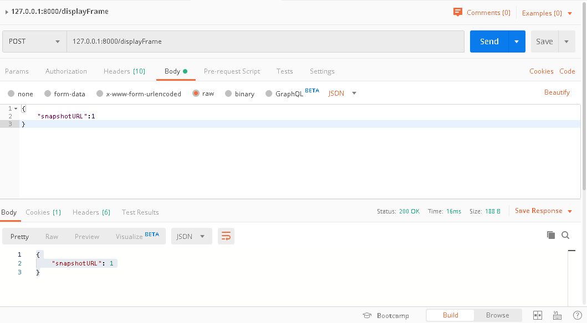
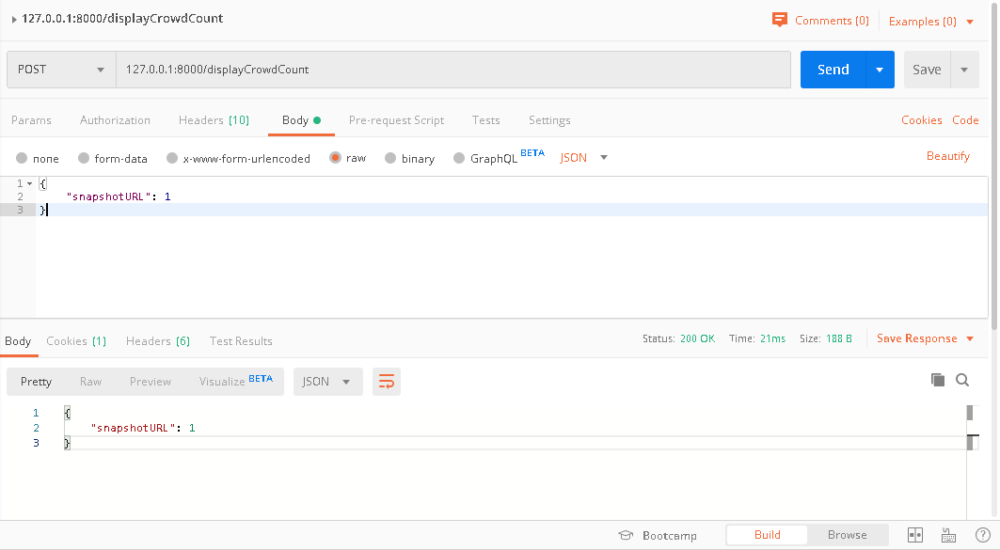

# Deployment.
- Default url for the app UI and API is http://127.0.0.1:8000

```bash
pip install -r requirements.txt
cd django_project/
python manage.py runserver
```

# Integration
Images needs to be in the following folders before it can be displayed in the UI:
- Raw image foler path: `django_project\fyp\static\fyp\img\raw`
- heatmap folder path: `django_project\fyp\static\fyp\img\heatmap`
- crowd graph foler path: `django_project\fyp\static\fyp\img\crowd_graph`

 3 API calls, refer to the 2 screenshots.
- displayAlert (to be called when there is an event detected)


- displayFrame (to be called to display raw frame and heatmap)


- displayCrowdCount (to be called to display the crowd count graph)



# Limitations
Event is only saved when it's handled, one event can be displayed at one time. If another event happened before current event is handled, current event will be lost.

